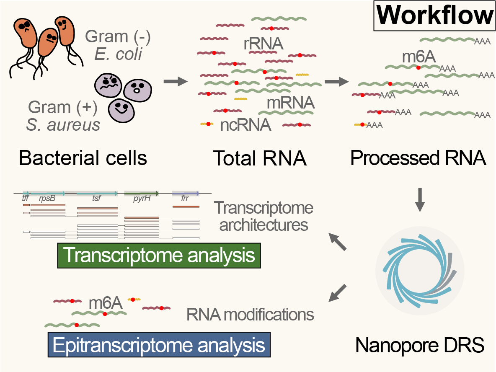

# ONT_DRS_bacteria_script

Script of our Paper "Analysis of Transcriptome and Epitranscriptome in Bacteria  Using Nanopore Direct RNA Sequencing"
This GitHub repository contains the script for generating figures mentioned 
in the article, as well as the intermediate files.

## Graphic abstract

## Transcript Units Extraction Script

We have provided a simple script to facilitate the extraction of transcript units (Path: Other_script/extract_TU.py).
Here is the usage of this script,

### Dependencies:

    pip install matplotlib 
    pip install pysam

### Options:

    python extract_TU.py -h

    optional arguments:
          -h, --help       show this help message and exit
          --bam BAM        bam file (from alignment result)
          --bed BED        bed file (from annotation)
          --is_drs         Turn on the direct RNA sequencing mode
          --cutoff CUTOFF  coverage cutoff (default:10)
          --output OUTPUT  result folder
### Results

This script will generate three data files (read_TU_list.csv, TU_coverage_list, context_num.csv) and one graph (context_pie.png), which record the following information:

**read_TU_list.csv**: This file contains a list of transcript units (TUs) associated with each read. It provides information on which TUs each read belongs to.

| read_name    | TU | 
|--------|----------|
|94c4929a-8630-4fd0-89d5-21f6bc399165|"('thrB', 'thrC', 'thrA')"|
|50c4123e-fe51-6513-c872-cda2ac6g8912|"('thrB', 'thrC')"|
|...|...|

**TU_coverage_list**: This file provides coverage information for each transcript unit. It includes details such as the genomic coordinates of the TUs and the coverage depth.

|TU| coverage|
|--------|----------|
|"('thrB', 'thrC', 'thrA')"|76|
|"('thrB', 'thrC')"|154|
|...|...|

**context_num.csv**: This file presents the number of transcript unit for each gene. It indicates the number of distinct TUs are observed per gene.

|gene|context_num|
|--------|----------|
|thrB|2|
|thrC|2|
|thrA|1|
|...|...|

**context_pie.png**: This graph, in the form of a pie chart, visually represents the distribution of different context number.

